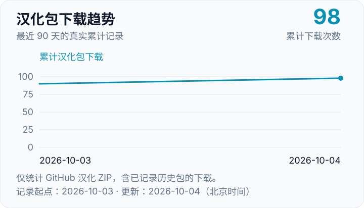

# REFramework Chinese Builder

为 REFramework 注入中文文本，跟随官方 Nightly（开发版）自动构建和发布，让《怪物猎人：荒野》的玩家更方便地使用中文界面。

**[下载最新汉化包](https://github.com/xuyuhong996/reframework-chinese-builder/releases/latest)** · [查看历史版本](https://github.com/xuyuhong996/reframework-chinese-builder/releases) · [反馈未汉化内容](https://github.com/xuyuhong996/reframework-chinese-builder/issues)

整理词库、适配更新和维护自动构建都需要投入时间。如果这个项目帮到了你，欢迎点个 Star（收藏支持），也请把项目链接分享给身边的玩家、朋友或游戏社区。**制作不易，好东西值得让更多人知道。** 你的分享与反馈，就是项目继续维护的动力。

## 原项目与作者

REFramework 的原作者项目为 [praydog/REFramework](https://github.com/praydog/REFramework)。本仓库在每次构建时拉取其 `master` 分支源码，并在此基础上注入中文文本后生成发布包。

本仓库是独立的汉化构建与发布项目，**不是 REFramework 原作者的官方仓库，也不代表原作者提供支持或兼容性保证**。REFramework 本体的源码、更新与技术问题请以原作者仓库为准。

## 使用范围说明

当前发布的 DLL **仅在《怪物猎人：荒野》** 中由作者实际使用过。

REFramework 也会被其他游戏使用，但作者没有在其他游戏中安装或验证过本项目生成的 DLL。因此，**不保证它适用于任何其他游戏**；请不要把它当作其他游戏的通用汉化 DLL 使用。

## 提交未汉化 Mod

如果你在《怪物猎人：荒野》中发现仍未汉化的 Mod，欢迎在本仓库的 Issues 中贴出 Mod 的发布链接，并说明界面中未汉化的大致位置。我会根据实际情况补充汉化库；是否能够适配取决于 Mod 的实现方式与可取得的文本内容。

## 获取成品

请从 **[最新汉化包](https://github.com/xuyuhong996/reframework-chinese-builder/releases/latest)** 页面下载 `REFramework-编号.zip`。每个 Release（发布版本）都会保留历史下载，并附带同名的 `SHA256` 校验文件。

最新版本请以页面的 **Latest（最新）** 标记为准，不要只看历史发布列表的第一条。

## 自动构建

GitHub Actions（自动工作流）计划每 15 分钟检查一次 [官方 Nightly 发布](https://github.com/praydog/REFramework-nightly/releases/latest)。发现新的 Nightly 标签后，使用 Windows Server 2022 和 Visual Studio 2022 构建环境拉取源码、注入汉化并创建 ZIP 发布。GitHub 的定时任务可能排队延迟，实际执行时间以 [运行记录](https://github.com/xuyuhong996/reframework-chinese-builder/actions/workflows/build-release.yml) 为准。

官方没有发布新版本时，检查成功后会跳过打包，这是正常行为。运行页面的摘要会显示官方标签、汉化发布和本次处理结果；需要重新构建时，维护者也可以手动运行工作流。手动运行时勾选“仅检查版本，不重新打包”，可以直接核对版本而不进行编译。

自动构建会固定使用本次检测到的 Nightly 对应源码提交，并将同一编号用于包名和发布记录，避免构建期间官方更新导致编号与源码不一致。

汉化包使用官方 **Nightly 编号**：例如官方 `nightly-01424-…` 对应发布标题 `REFramework-汉化-01424` 和附件 `REFramework-01424.zip`。官方主仓库的稳定版使用 `v1.5.9.1` 这类编号，属于不同发布系列，不能直接用来判断汉化版是否落后。

## 打赏支持

如果这个项目对你有帮助，欢迎通过微信打赏支持维护。


## 本地手动构建

```powershell
python build_chinese.py
```

## 下载趋势



每天自动记录 GitHub 汉化 ZIP 包的累计下载次数，显示最近 90 天的采样趋势；不包含校验文件、网盘下载，也不代表独立用户数。首次记录只有一个真实数据点，后续采样后会形成折线，过去每天的下载量无法补回。

统计保留已记录历史包的最后下载计数，即使旧附件被删除也不会丢失这些记录。日期按北京时间显示，完整记录可查看 [下载数据](assets/download-history.json)。
